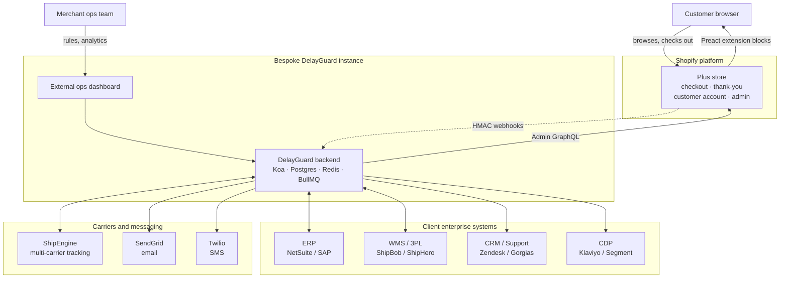
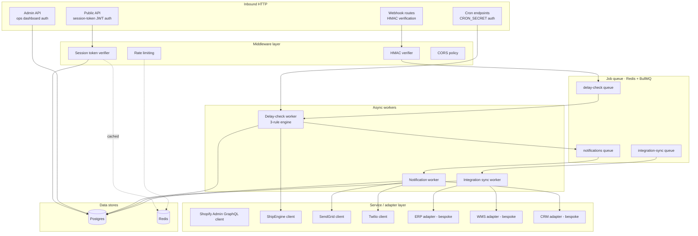
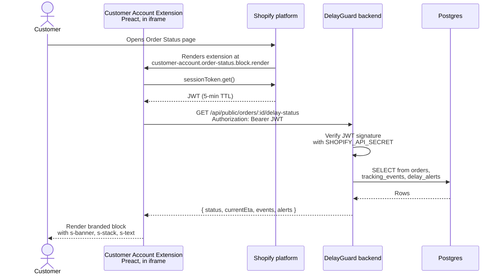
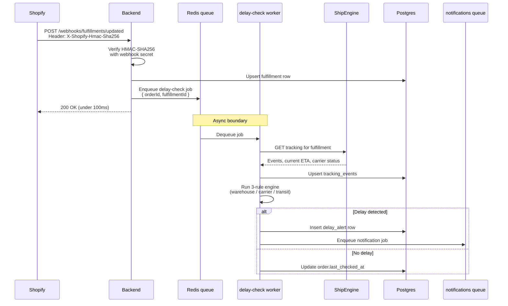
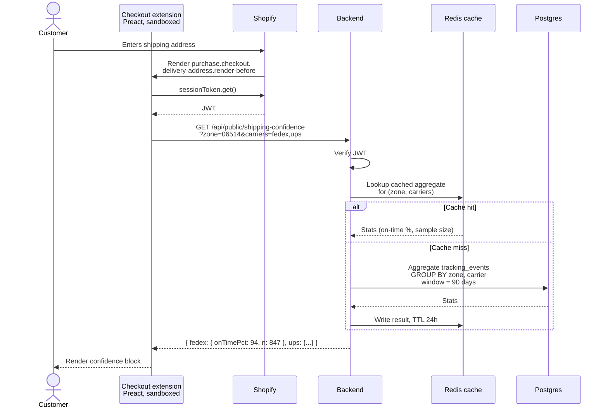
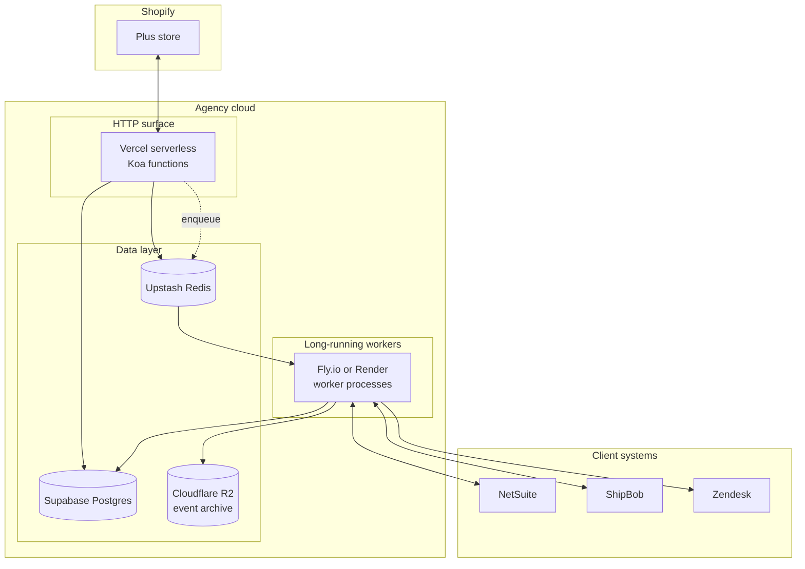
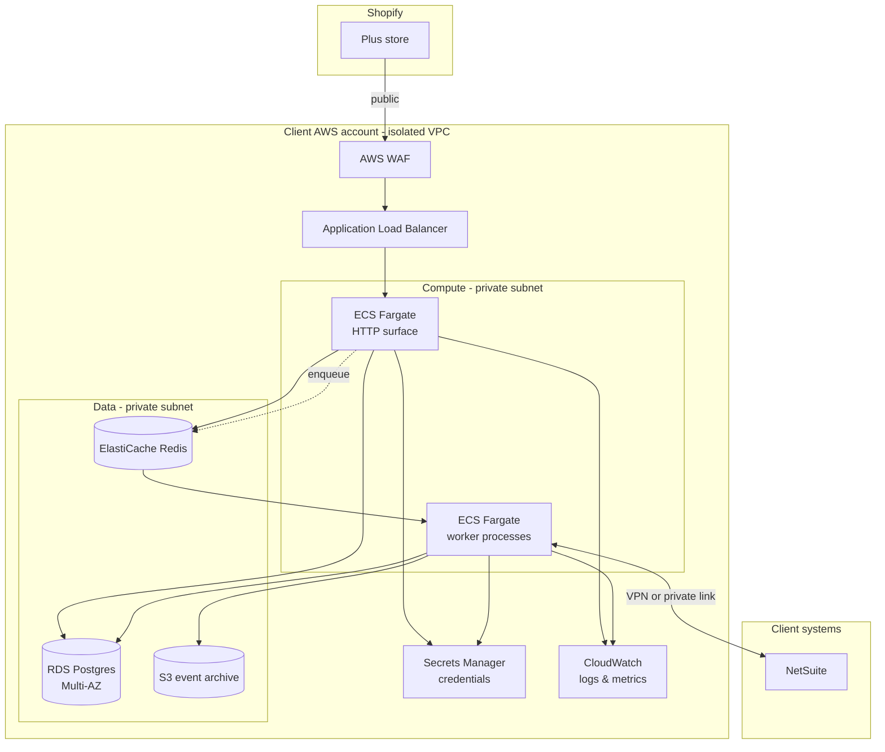
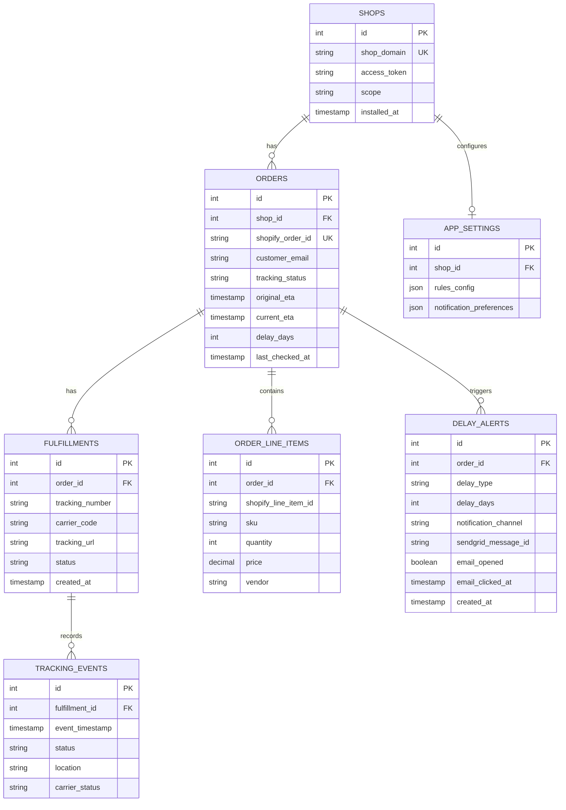
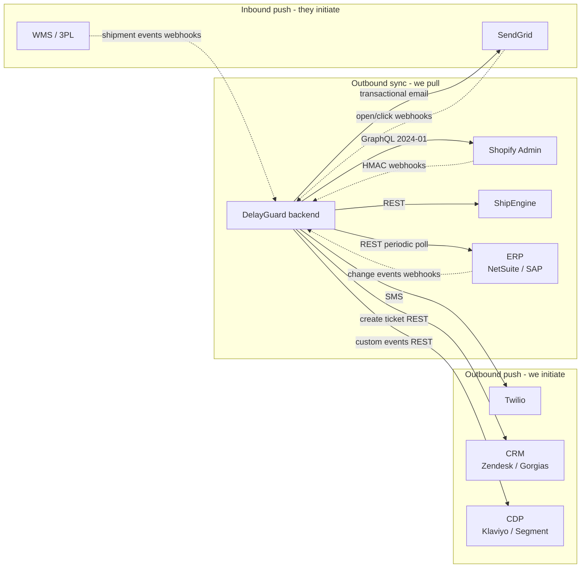

> ### Purpose of this document
>
> **This is interview preparation material, not part of the DelayGuard project roadmap.**
>
> - **Why it exists**: prep for a technical interview about Shopify Checkout Extensibility for a potential engagement at a different company.
> - **Role of DelayGuard here**: used as a concrete reference point — the author's own Shopify app, currently pre-launch — to illustrate architecture and capability. DelayGuard itself is not being proposed to the interviewer.
> - **Author**: Joong Kwun — augustok87@gmail.com
>
> **Companion files (all interview-prep only):**
> - `CHECKOUT_EXT_01_PUBLIC_APP_PROPOSAL.md` — public SaaS distribution path
> - `CHECKOUT_EXT_02_PRIVATE_PREMIUM_PROPOSAL.md` — single-merchant bespoke path
> - `CHECKOUT_EXT_03_ARCHITECTURE_DESIGN.md` — *this file* — technical architecture reference

---

# Architecture Design Reference
## Shopify Checkout Extensibility engagement (private premium client)

This document is the architectural backing for the proposal in `CHECKOUT_EXT_02_PRIVATE_PREMIUM_PROPOSAL.md`. It exists so that a technical deep-dive — with a CTO or a senior engineer — can be had against concrete diagrams rather than abstract claims.

Every section follows the same shape:

1. **The diagram** (rendered in Mermaid — shows up natively in GitHub, VS Code, and most markdown viewers)
2. **What the diagram is showing** — plain-English walkthrough
3. **Glossary** — every technical term used, defined in one sentence
4. **Likely interview questions** — what a CTO probably asks next, and how to answer

Sections are designed to stand alone. For a 30-minute interview, sections 1, 2, and the sequence diagrams in 3 are the core. Sections 4–7 are reference depth.

---

## Table of contents

1. [System context — the universe at a glance](#1-system-context)
2. [Backend component breakdown — what's inside the box](#2-backend-component-breakdown)
3. [Three key sequence flows](#3-three-key-sequence-flows)
   - 3.1 Customer views Order Status page
   - 3.2 Shopify webhook triggers delay detection
   - 3.3 Pre-purchase shipping confidence at checkout
4. [Deployment topology — two hosting options](#4-deployment-topology)
5. [Data model — the Postgres schema](#5-data-model)
6. [Integration topology — sync, async, push, pull](#6-integration-topology)
7. [Non-functional concerns — scaling, observability, security, DR](#7-non-functional-concerns)

---

## 1. System context

The highest-level view. Who talks to what, across the whole engagement.

### 1.1 The diagram

### 1.2 What the diagram is showing

There are **five worlds** that touch this system:

1. **The customer** — shops, pays, and then later comes back worried about where their order is. They interact only with the Shopify Plus store surface.
2. **The Shopify Plus store** — the actual checkout, thank-you page, customer account pages, and admin UI. Our code lives inside here as **extension bundles** rendered by Shopify at specific targets.
3. **Our bespoke backend** — a single-tenant DelayGuard instance (Koa + Postgres + Redis + BullMQ). The external ops dashboard is a separate web app the merchant's team uses for configuration and analytics.
4. **The client's enterprise stack** — their existing ERP, WMS, 3PL, CRM, and CDP systems. We integrate with whatever they actually use.
5. **Third-party carrier and messaging services** — ShipEngine for carrier tracking data, SendGrid for email, Twilio for SMS.

The **key flows** are:
- Shopify pushes data to us via HMAC-signed webhooks (dotted line — async, they initiate).
- We pull data from Shopify via the Admin GraphQL API (solid line — we initiate).
- Our backend orchestrates everything else: enriching orders with carrier tracking, detecting delays, firing notifications, syncing with the client's enterprise stack.

### 1.3 Glossary

| Term | What it means |
|---|---|
| **Extension bundle** | A small compiled package of Preact code Shopify runs in a sandbox at specific points in the store's UI (e.g., order status page). Max 64 KB per bundle. |
| **HMAC webhook** | A POST request Shopify sends us when something happens (e.g., an order is updated). Each request is cryptographically signed with a shared secret so we can verify it actually came from Shopify and wasn't forged. |
| **Admin GraphQL** | Shopify's authenticated API for reading and writing merchant data. We use it to fetch order line items, update fulfillments, etc. Requires an access token we got during OAuth install. |
| **Single-tenant** | Only this one client's data lives in this running instance. Opposite of multi-tenant, where many customers share infrastructure. |
| **Koa** | Node.js web framework — like Express but slightly more modern. DelayGuard's backend is built on it. |
| **BullMQ** | A job queue library that uses Redis to store work. Lets us say "handle this webhook later, asynchronously" instead of blocking the webhook response. |
| **Preact** | A smaller, faster alternative to React (3 KB vs ~40 KB). Shopify's UI extensions are Preact-based because of the 64 KB bundle limit. |
| **ERP / WMS / 3PL / CRM / CDP** | Enterprise software categories — Resource Planning, Warehouse Management, Third-Party Logistics, Customer Relationship Management, Customer Data Platform. |
| **ShipEngine** | A multi-carrier API that gives us a single integration for UPS, FedEx, DHL, USPS, etc. Instead of integrating with each carrier separately, we integrate once with ShipEngine. |

### 1.4 Likely interview questions

- **"Why a separate ops dashboard instead of an embedded admin app?"**
  Because custom-distribution apps can't use Shopify's App Bridge. The practical upside is that merchant ops teams prefer bigger screen real estate for bulk monitoring anyway — the embedded Shopify admin iframe is narrow and constrained. In-context per-order data still lives in Shopify admin via Admin UI Extension blocks.

- **"Why not integrate with each carrier directly?"**
  We could — but maintaining 6+ carrier integrations is its own engineering track. ShipEngine is a thin abstraction that gives us a unified tracking event schema across carriers, faster to ship, easier to maintain. If the client has a direct carrier relationship with negotiated rates or premium data access, we can add that as a dedicated adapter.

- **"What happens if Shopify is down?"**
  Webhooks queue up on Shopify's side and replay when they recover. Our inbound API surface is independent — the customer account extension continues to render cached state. The Admin GraphQL calls we make outbound retry with backoff.

---

## 2. Backend component breakdown

Zoom inside the "DelayGuard backend" box from section 1.

### 2.1 The diagram

### 2.2 What the diagram is showing

The backend has **five horizontal layers**:

1. **Inbound HTTP** — four distinct entry points, each with a different authentication model:
   - **Webhook routes** accept Shopify's push requests and verify them with HMAC.
   - **Public API** is what extensions call from inside the customer's browser; authenticated via short-lived JWT session tokens.
   - **Admin API** is what the ops dashboard talks to; authenticated via merchant login.
   - **Cron endpoints** are triggered on a schedule (e.g., "refresh tracking daily"); authenticated via a shared secret.

2. **Middleware layer** — cross-cutting concerns run on every request: authentication, rate limiting, CORS policy.

3. **Job queues** — three logical queues running on Redis via BullMQ. Queueing lets us respond to webhooks in under 100ms and do the real work asynchronously.

4. **Workers** — separate processes that drain the queues. Each worker has one job:
   - `delay-check` worker runs the 3-rule delay detection engine.
   - `notification` worker fans out to email, SMS, and CRM ticket creation.
   - `integration-sync` worker pushes/pulls data to the client's enterprise systems.

5. **Service / adapter layer** — each external system gets its own adapter. The adapter is the only place that knows how to talk to that system; the rest of the code calls it through a stable interface.

6. **Data stores** — Postgres for durable state (orders, tracking events, delay alerts); Redis for ephemeral state (queues, rate-limit counters, cached session tokens).

### 2.3 Glossary

| Term | What it means |
|---|---|
| **Middleware** | Code that runs on every request before it reaches the actual route handler. Used for things every request needs: auth, rate limiting, logging. |
| **Session token JWT** | A short-lived (5 min) signed token that proves "this request is coming from a valid Shopify extension on behalf of a specific shop and user." We verify the signature with our app secret. |
| **HMAC verification** | The act of recomputing Shopify's signature on the webhook body using our shared secret and comparing it to what Shopify sent. If they match, the webhook is authentic. |
| **Rate limiting** | Capping how many requests a single client can make per time window. Prevents abuse and accidental runaway loops. |
| **CORS** | Cross-Origin Resource Sharing — browser security rule that blocks a page on one domain from calling an API on another unless that API explicitly allows it. We configure CORS to allow the Shopify extension origin. |
| **Adapter pattern** | Structuring external system integrations so each one has a dedicated module with a stable interface. Swapping ShipEngine for a direct FedEx integration becomes a single-file change. |
| **Fan out** | Taking one trigger (e.g., "delay detected") and emitting multiple downstream actions (email + SMS + ticket) in parallel. |
| **Worker process** | A background process that's not handling HTTP requests — it just reads jobs off a queue and does the work. Workers run in separate container/process instances from the HTTP server. |

### 2.4 Likely interview questions

- **"Why three separate queues instead of one?"**
  Priority isolation. If the integration-sync queue backs up (e.g., ERP is slow today), it shouldn't delay delay-check jobs that customers are waiting on. Separate queues mean separate worker pools and independent backpressure.

- **"Are the workers running in Vercel serverless too?"**
  No — and this is a known gotcha. BullMQ workers need long-running processes, which don't fit the serverless model. In production we'd run workers on a platform that supports long-lived processes: Fly.io, Railway, Render, ECS Fargate, or a dedicated VM. The Vercel Functions side handles only the synchronous HTTP surface.

- **"How do you handle a worker crashing mid-job?"**
  BullMQ supports at-least-once delivery. Jobs have a retry count with exponential backoff (configured at 3 retries with 2-second initial delay). Jobs that exceed retries go to a failed state and surface on the ops dashboard for manual review. Idempotency at the worker level prevents duplicate work when a job is retried.

---

## 3. Three key sequence flows

Sequence diagrams show *time-ordered* behavior — who calls whom, in what order, and what waits on what.

### 3.1 Customer views Order Status page

**What's happening**: customer opens their order status page. Shopify renders our extension. Extension asks Shopify for a fresh session token (JWT), uses it to call our backend, which verifies the token, queries Postgres, and returns the delay status payload. Extension renders it using Shopify's `s-*` components.

**Performance note**: we target <300ms total wall-clock time from extension mount to paint. Session token fetch is local to Shopify's runtime (<10ms). The DB query is a single indexed read (~20ms). The network round-trip dominates.

**Glossary (new terms in this diagram)**:

| Term | What it means |
|---|---|
| **sessionToken.get()** | The specific API call the extension uses to request a JWT from Shopify's runtime. Shopify caches the token for us; we don't manually store it. |
| **`s-*` components** | Shopify's extension UI primitives (`s-banner`, `s-stack`, `s-text`, `s-heading`, `s-button`). They're web components, not React. They render inside the extension sandbox and have a fixed visual vocabulary. |
| **JWT signature** | The cryptographic proof at the end of every JWT. We recompute it with our app secret and compare; if they match, the token is authentic and hasn't been tampered with. |

### 3.2 Shopify webhook triggers delay detection

**What's happening**: Shopify sends us a webhook when a fulfillment updates. We verify its authenticity via HMAC, record the update in Postgres, and immediately enqueue a job — returning 200 OK to Shopify in under 100ms so they don't think we're slow. A worker picks up the job asynchronously, fetches tracking data from ShipEngine, runs our 3-rule engine, and either fires a delay alert or just updates the "last checked" timestamp.

**Why this shape**: Shopify retries webhooks that time out or return errors, and aggressive retries can cascade into problems. The "respond fast, do work async" pattern is the defensive shape for high-reliability webhook processing.

**Glossary (new terms)**:

| Term | What it means |
|---|---|
| **Upsert** | Database operation that inserts a row if it doesn't exist or updates it if it does. Short for "update or insert." |
| **Async boundary** | The point in a flow where execution stops being synchronous. Before the boundary, code runs in order. After it, work happens independently and in parallel. |
| **3-rule engine** | DelayGuard's delay detection logic: (1) warehouse delay = order unfulfilled more than N days; (2) carrier delay = current ETA pushed past original ETA; (3) transit delay = no tracking update in more than N days. Each rule fires independently. |
| **At-least-once delivery** | Queue semantics where a job is guaranteed to run at least once but may run more than once if the worker crashes mid-job. This is why idempotency matters. |

### 3.3 Pre-purchase shipping confidence at checkout

**What's happening**: during checkout, after the customer enters their shipping address, our extension renders. It fetches aggregate carrier-reliability data from our backend, scoped to the customer's destination zone. The aggregate is cached aggressively because recomputing it per-request would be wasteful — shipping reliability changes slowly.

**Why this matters architecturally**: this is the one flow where extension latency directly affects conversion. If the extension takes 2 seconds to render, customers see a UI flicker and the trust signal loses its impact. The cache layer is what makes this flow viable.

**Glossary (new terms)**:

| Term | What it means |
|---|---|
| **Cache hit / miss** | Whether the requested data was already stored in Redis (hit) or had to be computed from Postgres (miss). High hit rates are the whole point of having a cache. |
| **TTL (time to live)** | How long a cached value is considered valid before it's thrown out and recomputed. 24 hours for shipping aggregates is aggressive but defensible — the signal doesn't swing hourly. |
| **GROUP BY** | A SQL clause that collapses rows into aggregates. `SELECT carrier, AVG(delay_days) FROM tracking_events GROUP BY carrier` gives you average delay per carrier. |

### 3.4 Likely interview questions across all three flows

- **"Why is session token verification happening on every request instead of caching it?"**
  The JWT is already cached on Shopify's side — `sessionToken.get()` returns a cached token until TTL expires. On our backend, verifying the signature is cheap (microseconds). Caching verification decisions introduces security complexity without meaningful performance benefit.

- **"What's the total latency budget for the Order Status extension?"**
  Target <300ms extension-mount to paint. Breakdown: session token fetch ~10ms, network round-trip ~100ms, JWT verify <1ms, DB query ~20ms, response serialization ~5ms, extension render ~50ms. Remaining ~100ms is headroom for tail latency on the network.

- **"What happens if a delay-check worker runs the same job twice?"**
  The worker is idempotent. It looks up whether a `delay_alert` row already exists for this order + delay-type in the last N hours before inserting. Duplicate notification enqueue is prevented by the same check.

---

## 4. Deployment topology

Two physical-hosting options with meaningfully different characteristics. The choice depends on the client's compliance posture and whether they want operational control.

### 4.1 Option A — Agency-hosted

**What's happening**: all infrastructure sits in the agency's cloud footprint. Vercel hosts the HTTP surface (webhooks and public API) on serverless functions. Fly.io hosts the long-running worker processes. Supabase hosts Postgres, Upstash hosts Redis, Cloudflare R2 holds archived event data. The client's enterprise systems sit in their own network and are called over the internet through the worker layer.

**When this is the right choice**:
- Client wants minimum operational burden
- Client has no strong compliance requirement that data live in their own cloud
- Client is comfortable with agency as the data custodian
- Fastest path to production (1–2 weeks shorter than Option B)

**Cost profile**: typically $400–$1,200/month in infrastructure for a mid-sized Plus merchant. Covered within retainer.

### 4.2 Option B — Client-cloud hosted (e.g., AWS)

**What's happening**: all infrastructure lives in the client's AWS account. We deploy containers into ECS Fargate (separate task definitions for HTTP vs. workers). Data lives in RDS Postgres and ElastiCache Redis, both in private subnets — never exposed to the internet. WAF + ALB handle the public HTTP surface. Secrets Manager stores credentials. CloudWatch centralizes logs and metrics. The client's ERP can be reached over VPN or AWS PrivateLink — data never crosses the public internet.

**When this is the right choice**:
- Compliance requirement that data stay in client's boundary (GDPR, HIPAA-adjacent, SOC2 scope)
- Client's security team demands infrastructure-as-code review
- Client has existing AWS investment and wants unified billing and monitoring
- Engagement expected to run long-term (5+ years) — client-cloud is more transferable when/if the engagement ends

**Cost profile**: billed directly to the client's AWS account, typically $800–$2,500/month for mid-sized volume. The agency retainer covers infrastructure-as-code maintenance but not AWS charges themselves.

### 4.3 Glossary

| Term | What it means |
|---|---|
| **Serverless functions** | Compute that scales to zero when idle and spins up per-request. You pay per invocation. Ideal for spiky HTTP traffic; bad for long-running work. |
| **Long-running workers** | Processes that stay up continuously, processing jobs from a queue. The opposite of serverless. Needed for BullMQ. |
| **Multi-AZ** | "Multiple availability zones" — the database has a hot standby in a separate data center. If the primary fails, traffic fails over automatically with usually <60s downtime. |
| **VPC / private subnet** | Virtual Private Cloud — a network boundary inside AWS where you control what's exposed. Private subnets are unreachable from the public internet. |
| **ECS Fargate** | AWS's serverless container runtime — you specify containers, AWS runs them without you managing servers. |
| **WAF** | Web Application Firewall — filters malicious HTTP traffic before it reaches your servers. |
| **ALB** | Application Load Balancer — distributes HTTP requests across multiple backend containers. |
| **Infrastructure-as-code** | Defining your cloud resources in code (Terraform, CDK, Pulumi) rather than clicking around a web console. Makes deployments reviewable, repeatable, and version-controlled. |
| **AWS PrivateLink** | A way to connect two AWS networks privately without traversing the public internet. Used when the client's ERP also lives in AWS. |
| **Secrets Manager** | AWS service that stores credentials (DB passwords, API keys) and lets running containers retrieve them without hardcoding. |

### 4.4 Likely interview questions

- **"What if the client wants GCP or Azure instead of AWS?"**
  The shape is identical — managed Postgres (Cloud SQL / Azure Database), managed Redis (Memorystore / Azure Cache), managed containers (Cloud Run / Azure Container Apps), managed secrets, managed logs. The diagram redraws; the architecture doesn't change.

- **"How do you migrate from Option A to Option B?"**
  It's not free, but it's tractable. Postgres dump and restore (scheduled maintenance window), infrastructure-as-code deploy to client cloud, DNS cutover. We've estimated it at 2–3 days of focused work plus whatever the compliance review on their side takes. Worth including in the SOW as a future-option clause.

- **"What's the observability story?"**
  Structured JSON logs to CloudWatch (or Datadog/Grafana Cloud if the client has those). Metrics on every queue depth, every worker job duration, every external API call. Alerts on queue backup, error rate, and tail latency. Section 7 goes deeper.

---

## 5. Data model

The Postgres schema. Shows what we store and how entities relate.

### 5.1 The diagram

### 5.2 What the diagram is showing

Seven tables, structured hierarchically around the shop → order → fulfillment spine.

- **`shops`** — one row per installed shop. Stores the OAuth access token and scope. In a single-tenant engagement this table has exactly one row.
- **`orders`** — one row per Shopify order we care about. Pre-computed fields (`current_eta`, `delay_days`, `last_checked_at`) let the Order Status extension read a single indexed row for its payload.
- **`fulfillments`** — one order can have multiple fulfillments (split shipments). Each carries tracking number and carrier.
- **`tracking_events`** — the event stream from the carrier, one row per status update. This is the highest-volume table and the one we aggregate for the shipping confidence widget.
- **`delay_alerts`** — one row per time we detect a new delay condition on an order. Denormalized fields for email delivery tracking.
- **`order_line_items`** — SKU-level detail, used by the ops dashboard for analytics (which products drive the most delay alerts).
- **`app_settings`** — merchant-configurable rules and preferences.

**Relationships** (the `||--o{` notation):
- `||--o{` means "one to many" — one shop has many orders.
- `||--o|` means "one to zero-or-one" — one shop has at most one settings record.

### 5.3 Indexes that matter

Not visible in the diagram but critical:
- `orders.shopify_order_id` — unique, used for webhook idempotency
- `orders.shop_id, orders.last_checked_at` — composite, used by the cron refresh
- `tracking_events.fulfillment_id, event_timestamp DESC` — for latest-status reads
- `tracking_events.event_timestamp, carrier_code` — for shipping-confidence aggregates
- `delay_alerts.order_id, delay_type` — for idempotent alert insertion

### 5.4 Glossary

| Term | What it means |
|---|---|
| **PK / FK / UK** | Primary Key (unique identifier for this row), Foreign Key (references another table's PK), Unique Key (non-PK field that must still be unique). |
| **Denormalized field** | A field that could be computed from other data but is stored pre-computed for read performance. `orders.delay_days` is denormalized — we could calculate it from `tracking_events` but it'd be slow. |
| **Composite index** | An index across multiple columns. Useful when queries filter/sort on those columns together. |
| **Idempotency** | The property that doing an operation multiple times produces the same result as doing it once. Critical for webhook handlers because Shopify may retry. |

### 5.5 Likely interview questions

- **"Why do you denormalize `current_eta` onto the order instead of always computing it from tracking events?"**
  Read-path performance. The customer-facing Order Status extension reads this value on every page view. A single indexed row lookup beats an aggregate query every time. The tradeoff is write-path complexity — the delay-check worker has to update `orders.current_eta` every time it processes a new event. That's a good tradeoff for a read-heavy workload.

- **"How big does `tracking_events` get?"**
  Rough math: a mid-sized merchant with 10K orders/month, average 2 fulfillments per order, 8 events per fulfillment = 160K rows/month ≈ 2M rows/year. Postgres handles this comfortably with the right indexes, but we'd partition by month at ~10M rows for query predictability. Archived events can be moved to S3 via the integration worker.

- **"What's in `app_settings.rules_config`?"**
  JSON blob with merchant-configurable thresholds: `{ warehouseDelayDays: 2, transitStaleDays: 3, notificationChannels: ['email', 'sms'], delayDiscountPercent: 10 }`. Stored as JSONB for flexibility without requiring schema migrations for every new rule.

---

## 6. Integration topology

How we talk to the client's enterprise systems and external services. This section is almost always where the real complexity of a premium engagement lives.

### 6.1 The diagram

### 6.2 What the diagram is showing

Integrations fall into three patterns, and recognizing which pattern applies to a given system is half the integration design work.

**Pattern 1 — Outbound sync (we pull)**: we initiate a request and the external system responds. Best for systems we can poll or query on demand. Shopify Admin GraphQL is the canonical example — we always call it, it never calls us. Tradeoff: we have to decide how often to poll, and we're responsible for not overwhelming the other system.

**Pattern 2 — Inbound push (they initiate)**: the external system notifies us of events via webhook. Best for change events that are infrequent but urgent (order updated, shipment dispatched). Tradeoff: we have to expose a public authenticated endpoint and handle retries, duplicates, and out-of-order delivery.

**Pattern 3 — Outbound push (we initiate the action)**: we send the other system a command or event. Email, SMS, ticket creation, lifecycle events. Tradeoff: we own the delivery guarantee, retries, and error handling.

### 6.3 Integration-by-integration summary

| System | Direction | Protocol | Auth | Retry strategy |
|---|---|---|---|---|
| Shopify Admin | We pull | GraphQL | OAuth access token | App-level retry with backoff |
| Shopify webhooks | They push | HTTP POST | HMAC-SHA256 | Shopify retries on 5xx |
| ShipEngine | We pull | REST | API key | Retry with backoff, circuit break on sustained 5xx |
| SendGrid | We push + they push | REST + webhooks | API key + HMAC | Webhook replay on failure |
| Twilio | We push | REST | API key + token | Retry on network errors only |
| ERP (e.g., NetSuite) | We pull periodically, they push change events | REST + webhooks | Per-system (OAuth, API key, mTLS) | Per-system |
| WMS / 3PL | They push | HTTP POST webhook | Per-system, usually shared secret | They retry; we acknowledge |
| CRM (Zendesk, Gorgias) | We push | REST | API key | Retry with backoff |
| CDP (Klaviyo) | We push | REST | API key | Retry; fire-and-forget semantics |

### 6.4 Glossary

| Term | What it means |
|---|---|
| **Polling** | Asking a system "anything new?" on a schedule. Inefficient but simple. Used when webhooks aren't available. |
| **Webhook** | The other system pushes events to a URL we expose. More efficient than polling because nothing happens until there's something to say. |
| **Circuit breaker** | A pattern where, if a downstream system fails repeatedly, we stop calling it entirely for a cooling-off period. Prevents cascading failures. |
| **Fire-and-forget** | Sending an event without waiting for confirmation. Used when the receiver is advisory (e.g., analytics) and we don't need to know it landed. |
| **Backoff** | Waiting progressively longer between retries. "Exponential backoff" doubles the wait each time (1s, 2s, 4s, 8s, ...). Prevents thundering-herd when a system recovers. |
| **mTLS** | Mutual TLS — both sides of the connection present a certificate. Used for high-trust enterprise integrations where API keys aren't enough. |
| **Out-of-order delivery** | When webhook A and webhook B arrive in the wrong order (e.g., "shipped" arrives before "packed"). Systems must handle this gracefully, usually by keying off an event timestamp rather than arrival order. |

### 6.5 Likely interview questions

- **"What if the client's ERP doesn't have webhooks?"**
  Most don't, honestly. We fall back to periodic polling — usually 5–15 minute intervals on a changed-since cursor. Slower, but functional. If the ERP has a message bus (e.g., NetSuite SuiteAnalytics Connect), we can hook into that. If not, we run a scheduled worker that polls their API and converts the delta into internal events.

- **"How do you prevent duplicate webhook processing?"**
  Every webhook carries an event ID or the payload itself is idempotent when keyed off the resource ID. On the way in, we insert into an `inbox` table keyed on `(source, event_id)` with a unique constraint. If the insert conflicts, we've seen this event before and we drop it. Clean, simple, battle-tested pattern.

- **"What's the blast radius if the CRM integration breaks?"**
  Scoped. Ticket creation is fire-and-forget from the notification worker's perspective — if it fails, we log it and retry, but we don't block the email/SMS notification from going out. Customer experience degrades gracefully: they still get the delay email, merchant's support team just doesn't get a ticket until we reconcile. We alert the ops team when the CRM error rate exceeds threshold.

---

## 7. Non-functional concerns

The stuff that doesn't show up in feature diagrams but makes or breaks a production system.

### 7.1 Scaling

**Expected load** for a mid-sized Plus merchant:
- ~10K orders/month → ~300/day average, peaks of ~1K/day during promotions
- ~20K fulfillments/month → ~650/day
- ~160K tracking events/month → ~5K/day
- ~100 delay alerts/day
- Customer Account extension views: ~10K/day (customers checking "where's my order")

**Bottlenecks, in order of likely appearance**:
1. **Worker throughput on delay-check** — a promotion spike can enqueue 10K jobs in an hour. Solution: horizontal scale workers (2–4 instances), queue concurrency of 10 per instance.
2. **Postgres connection count** — naive serverless + long-running workers can exhaust connections. Solution: PgBouncer or equivalent connection pool.
3. **ShipEngine rate limits** — vary by plan, typically 100/sec. Solution: BullMQ rate-limiting on the delay-check queue caps external API pressure.
4. **Shopify Admin API rate limits** — GraphQL cost-based limits; we implement backoff on throttle responses.

### 7.2 Observability

Three signals, unified across environments:

| Signal | Tool | What we instrument |
|---|---|---|
| **Logs** | Datadog / CloudWatch / Grafana Loki | Every HTTP request, every job start/finish, every external API call, every error with stack trace |
| **Metrics** | Datadog / CloudWatch Metrics | Queue depth per queue, job duration p50/p95/p99, error rate, webhook throughput, extension API latency |
| **Traces** | Datadog APM / OpenTelemetry | End-to-end request traces: extension request → JWT verify → DB query → response |

Alerts on: queue depth >1000 for >5min, job failure rate >5%, extension API p95 latency >500ms, any crash loop.

### 7.3 Security

| Concern | Control |
|---|---|
| OAuth token leak | Tokens stored encrypted at rest (AWS KMS / Supabase Vault). Never logged. Redacted in error output. |
| Webhook forgery | HMAC-SHA256 verification on every inbound webhook. Constant-time comparison (avoids timing attacks). |
| Extension-to-backend forgery | Session token JWT verification on every request. Shop scope claim checked against the order being requested — prevents cross-shop data access. |
| Database injection | Parameterized queries only. No string concatenation. |
| Secrets management | AWS Secrets Manager / Vercel env vars. Never in code, never in repo. |
| PII handling | Customer email, phone, address stored. No card data ever (Shopify handles that). GDPR deletion support via Shopify's `customers/redact` webhook. |
| Rate limiting | Per-shop and per-IP rate limits on public API endpoints. |
| Dependency vulnerabilities | Dependabot / Renovate for automated dep updates. CI pipeline blocks on high-severity CVEs. |

### 7.4 Disaster recovery

| Scenario | Recovery mechanism | RTO | RPO |
|---|---|---|---|
| Postgres corruption | Daily automated snapshots + PITR (point-in-time recovery) | 1–2h | <5 min |
| Redis cluster failure | BullMQ jobs are durable in Redis — with persistence enabled, jobs survive restart | 15 min | 0–30s |
| Region outage (Option B) | Multi-AZ RDS auto-failover; workers re-deploy in surviving AZ | <5 min | 0 |
| Accidental data deletion | PITR to timestamp before incident | 1h | <5 min |
| Total infrastructure loss | Infrastructure-as-code redeploys the stack; DB restored from off-region snapshot | 4–8h | <24h |

**RTO** = Recovery Time Objective (how long until we're back up). **RPO** = Recovery Point Objective (how much data we might lose).

### 7.5 API version lifecycle

Shopify deprecates APIs on a 12-month cycle. We pin:
- Admin GraphQL API version in the backend (currently 2024-01)
- Checkout UI extension API version in each `shopify.extension.toml` (currently 2026-01)
- Customer Account UI extension API version in each `shopify.extension.toml` (currently 2026-04)

Retainer scope includes **quarterly version audits**: check for upcoming deprecations, upgrade to next stable version, test in dev, deploy. Budgeted at ~4 days/quarter.

### 7.6 Glossary

| Term | What it means |
|---|---|
| **p50/p95/p99** | Percentile latencies. p95 means "95% of requests finish in less time than this." p99 tail latency is what angry customers actually experience. |
| **PITR** | Point-in-time recovery — restoring a database to exactly the state it was in at a specific timestamp, not just the last snapshot. |
| **RTO / RPO** | See 7.4. These are the standard DR planning numbers. |
| **APM** | Application Performance Monitoring — tools that trace requests through the stack and show you where time is spent. |
| **CVE** | Common Vulnerabilities and Exposures — the public database of known security flaws in software. |
| **Dependabot / Renovate** | Tools that scan your dependencies and open PRs to upgrade them when new versions (especially security patches) ship. |
| **Crash loop** | When a process keeps starting, crashing, restarting, crashing in a tight loop. Usually indicates a config or code bug, and it burns resources. |

### 7.7 Likely interview questions

- **"What's the plan if this has to handle 10x the load?"**
  HTTP surface scales horizontally on its own (serverless or Fargate auto-scaling). Workers scale by adding instances — each queue has a per-instance concurrency limit, so adding workers linearly adds throughput. Postgres is the one place that needs planning: read replicas handle most of the extension read path, write-path bottlenecks get addressed by table partitioning (especially `tracking_events`).

- **"How do you know the system is healthy at 3am?"**
  Synthetic checks hit the Order Status extension flow every 60 seconds — they actually acquire a JWT and call the public API and verify the response shape. Real user monitoring on the extension side tracks mount-to-paint latency. Any metric going red pages the on-call engineer. Quiet periods of no pages + healthy metrics = we're good.

- **"Biggest risk you see?"**
  ERP integration drift. Shopify and ShipEngine have stable APIs with documented deprecation cycles. ERPs and WMSs routinely ship breaking changes with 0–30 days notice. The mitigation is contract testing — we have a test suite that runs against the ERP's sandbox and catches shape changes before they hit production. Even with that, ERP integration is the thing I'd budget the most "unknown unknowns" for.

---

## End of document

If there's a question this document doesn't answer, flag it — I'd rather learn about the gap now than discover it mid-meeting.
